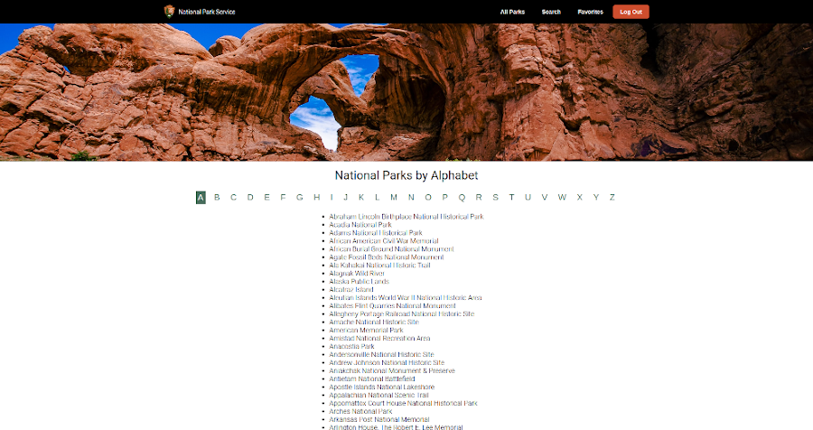
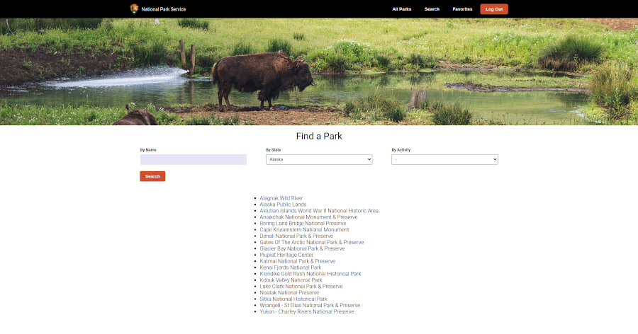
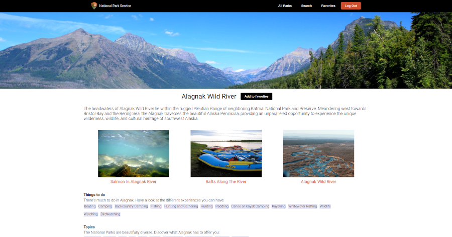
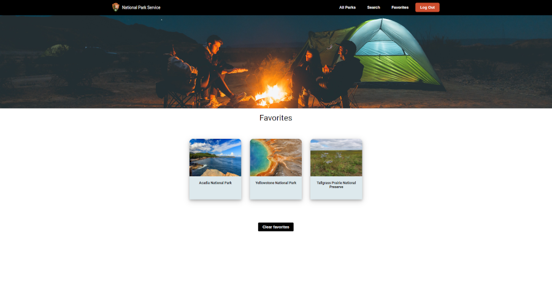

# National Park Service - React App

### Table of Contents
1. About the project  
1.1 Introduction  
1.2 Functionality  
1.3 Preview   
2. Getting Started  
2.1 Installation  
2.2 Logging in
    
 
## 1. About the project

**1.1 Introduction** 
The National Park Service App has been developed for those who are interested in discovering the beautiful nature of the United States. The US has some of the most stunning National Parks globally. With 424 parks, choosing which one to visit can be challenging.
The NPS app is a great way for orientation and planning. Have a look at the full list of National Parks or search one or more specific park(s). Read the detailed park information and bookmark the park(s) you like. Use the app to choose a park that is right for you.
 
 

**1.2 Functionality**

- Authorization:
  - The user can register and then login to the NPS app, which allows them to get access to: 
    - The full list of National Parks;
    - Search (a) specific park(s) by name, state or activity;
    - Read detailed park information and see photo's;
    - Bookmark parks to get a list of favorites;
  - The [Novi backend](https://github.com/hogeschoolnovi/novi-educational-backend-documentation) is being used for registering, validating and logging in users.
  

- Full list of National Parks:
  - On the 'All Parks page' the user gets the full list of National Parks. The user can click on a park name to read the detailed park information.
  - At the top of the page there is an 'A to Z alphabet bar'. It allows the user to quickly filter the full list to show only the parks starting with a specific letter.    

- Search function:
  - On the 'Search page' the user can search one or more parks by entering the name or by selecting a state or activity. The user can then click on a park name to read the detailed park information.

- Detailed park information:
  - On the 'Detailed Information page' the user can read a description of the park, see some photos, read about the activities you can do and the themes related to the park. At the bottom of the page the user can find the contact info.
  - With one click the user can add the park to the list of favorites.

- Favorites:
  - On the 'Favorites page' the user can find an overview of the parks that were bookmarked. The user can also clear favorites to create a new list.
     
     

**1.3 Preview**

*1.3.1. Preview of the All Parks page*  

*1.3.2. Preview of the Search page*  

*1.3.3. Preview of the Detailed Information page*  

*1.3.4. Preview of the Favorites page*  

 
 

## 2. Getting Started

This project was bootstrapped with [Create React App](https://github.com/facebook/create-react-app). Full documentation can be found at the [Create React App documentation](https://facebook.github.io/create-react-app/docs/getting-started).

**2.1 Installation** 

**Step 1. Install an IDE (Integrated Development Environment)**
- In order to open, use or modify the application, you must have an IDE installed on your computer. This application is built in the Webstorm IDE, but you can also use another similar IDE.

**Step 2. Install Node.js and npm**  
- Before you start, you will need to have Node.js and npm installed on your system. Check if Node.js and npm are installed on your system and which version it is, by running the following commands on the command line: `node -v` and `npm -v`.    

- Check [this](https://nodejs.org/en/download/) website to download and install the latest version.  

**Step 3. Clone the repository from GitHub**  
- To get a copy of the Git repository locally, clone the project by running the following command on the command line: `git clone https://github.com/MariekeTeuben/frontend-react-eindopdracht`

**Step 4. Install dependencies**  
- All dependencies can be found in the package.json file. Install them all at once by running the following command on the command line: `npm install`

**Step 5. Obtain API key at the National Park Service**  
- In this project, the National Park Service API is used. For the full documentation of this API, check the [NPS website](https://www.nps.gov/subjects/developer/api-documentation.htm).
- Before you can use this project yourself, you will first need to obtain an API key by registering for a [NPS account](https://www.nps.gov/subjects/developer/get-started.htm). Once you obtain your API key, you can use it in the API requests.

**Step 6. Run the project locally**  
- In order to run the project locally, enter the following command on the command line `npm start`. 
- Then open [http://localhost:3000](http://localhost:3000) to view the application in your browser.
 
 

**2.2 Login** 
The application uses the [Novi backend](https://github.com/hogeschoolnovi/novi-educational-backend-documentation) for registering, validating and logging in users. 

**Step 1. Sign up**  
- In order to use or modify the application, you will first need to register an account. On the 'sign-up page' you can create an account by entering your username, email address and password. You can reach the sign-up page by clicking on 'Start your experience' on the homepage or by clicking 'Sign up' in the top menu.   

**Step 2. Sign in**  
- On the 'sign-in page' you can log in by entering your username and password. You will be redirected to this page after creating your account or you can click 'Sign in' in the top menu.

**Step 3. Enjoy!**  
- You can now start discovering the beauty of America's Nature!
   
   

Marieke Teuben, 2023

 

